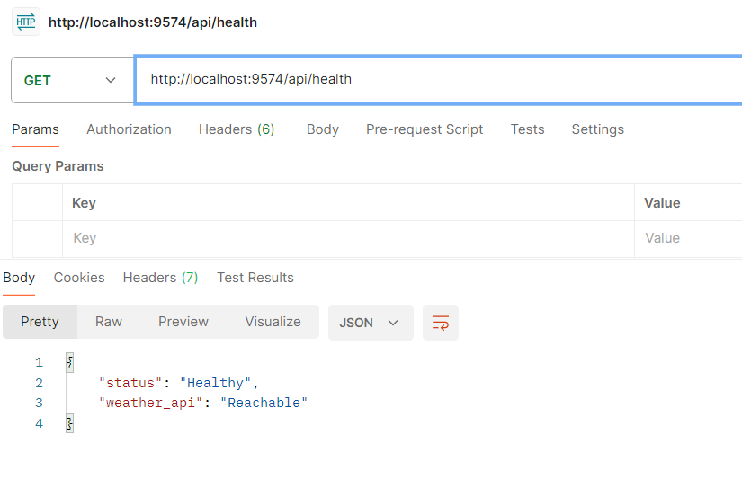

# 1 Background

This project is a complete implementation of a RESTful weather API service that provides real-time weather data for Dhaka city. It is designed with full automation in mind using modern DevOps principles and tools, including:

- Docker & Docker Compose for containerization
- AWS EKS for Kubernetes orchestration
- Terraform for infrastructure-as-code
- Jenkins for CI/CD pipeline automation
- GitHub Releases and Webhooks for deployment triggers
- AWS CloudWatch for observability

The project is optimized for zero-downtime deployment and production readiness.
# 2 API Response Format
### Required Format
The `/api/hello` endpoint returns data in the following JSON format:

```json
{
  "hostname": "Niaz",
  "datetime": "2505131220",
  "version": "2.4.3", // Version should match with the latest release tag
  "weather": {
    "dhaka": {
      "temperature": "38.27",
      "temp_unit": "c"
    }
  }
}
```

The `/api/health` endpoint returns data in the following JSON format:
```json
{
  "status": "Healthy",
  "weather_api": "Reachable"
}
```

### Achieved Format

`/api/hello` response - 

 <--- Latest release tag

`/api/health` response -



# 3 Features

-  REST API endpoint `/api/hello` for weather data
-  Health check endpoint `/api/health` to verify API and third-party availability
-  Built using Docker and deployed via Kubernetes on AWS EKS
-  CI/CD enabled via Jenkins and GitHub webhooks
-  Secrets managed securely using Kubernetes Secrets
-  Versioning tied directly to GitHub Releases
-  Zero downtime deployments with Kubernetes rolling updates
-  Cloud observability with AWS CloudWatch

# 4 Project Structure
```
weather-api/
│
├── index.js # Application Code
│
├── node_modules #node.js dependencies
│
├── package-lock.json
│
├── package.json
│
├── pipeline/ # CI/CD specific files
│ ├── Dockerfile
│ ├── Jenkinsfile
│ └── docker-compose.yaml
│
├── kubernetes/ # Kubernetes manifests
│ ├── deployment.yaml
│ ├── secret.yaml
│ └── service.yaml
│
├── terraform/ # Terraform IaC
│	│	├── main.tf
│ 	│	├── outputs.tf
│ 	│	└── variables.tf
│	│
│	└──modules/
│		├── eks/
│		│	├── main.tf
│ 		│	├── modules.tf
│ 		│	└── variables.tf
│ 		├── nodegroup/
│		│	├── main.tf
│ 		│	├── modules.tf
│ 		│	└── variables.tf
│		└── vpc/
│			├── main.tf
│ 			├── modules.tf
│ 			└── variables.tf│
│ 
├── .dockerignore
├── .gitignore
└── README.md
```
# 5 Setup Guide
### 5.1 Jenkins and Required Tools Setup

#### Step 1: Run Jenkins with Docker

```bash
docker run -d --name jenkins \
  -p 8080:8080 -p 50000:50000 \
  -v jenkins_home:/var/jenkins_home \
  -v "$HOME/.aws:/root/.aws" \
  -v /var/run/docker.sock:/var/run/docker.sock \
  jenkins/jenkins:lts
```
#### Step 2: Install Jenkins Plugins

- Pipeline
- Docker
- Kubernetes
- Generic Webhook Trigger
- AWS Credentials

#### Step 3: Tools to Install Inside Jenkins Container

 - User add with sudo permission to run docker commands
 - Docker CLI
 - AWS CLI
 - Kubectl
 - Git

### 5.2 AWS IAM Setup
#### Step 1: Create IAM User
- Name: `Niaz_IAM`
- Assign programmatic access

#### Step 2: Create IAM Group
- Name: `Niaz_IAM_Group`
- Attach policies:
  - `AmazonEKSClusterPolicy`
  - `AmazonEKSWorkerNodePolicy`
  - `AmazonEC2ContainerRegistryReadOnly`
  - `CloudWatchFullAccess`
  - `AmazonEKSServicePolicy`

#### Step 3: Add user to group
Download access keys and configure inside Jenkins container via: `aws configure`

### 5.3 Kubernetes Cluster Deployment via Terraform
#### Directory Structure
```
├── terraform/ # Terraform IaC
	│	├── main.tf
 	│	├── outputs.tf
 	│	└── variables.tf
	│
	└──modules/
		├── eks/
		│	├── main.tf
 		│	├── modules.tf
 		│	└── variables.tf
 		├── nodegroup/
		│	├── main.tf
 		│	├── modules.tf
 		│	└── variables.tf
		└── vpc/
			├── main.tf
 			├── modules.tf
 			└── variables.tf│
```
#### Setup
 - Go inside the terraform directory `cd /weather-api/terraform`
 - Run the following commands: 
        - `terraform init`
        - `terraform plan`
        - `terraform apply`
    This sets up the EKS cluster in AWS

### 5.4 Deploy Application to EKS

Make sure `kubectl` is configured:

```bash
aws eks update-kubeconfig --region us-east-1 --name weather-api
```
Apply the kubernetes manifests:
`kubectl apply -f kubernetes/secret.yaml`
`kubectl apply -f kubernetes/service.yaml`
`kubectl apply -f kubernetes/deployment.yaml`

### 5.5 CI/CD Pipeline Setup
#### Github Webhook Trigger
Configure a GitHub webhook pointing to:
### `Jenkinsfile`
```
 pipeline {
    agent any

    environment {
        DOCKERHUB_USER = 'n1az'
        IMAGE_NAME = "${DOCKERHUB_USER}/weather-api"
    }

    triggers {
        GenericTrigger(
            genericVariables: [
                [key: 'RELEASE_TAG', value: '$.release.tag_name']
            ],
            causeString: 'Triggered by GitHub Release $RELEASE_TAG',
            token: 'n1az-webhook-token',
            printContributedVariables: true,
            printPostContent: true
        )
    }

    stages {
        stage('Initialize') {
            steps {
                script {
                    if (!env.RELEASE_TAG) {
                        error("RELEASE_TAG was not provided by the webhook.")
                    }
                    env.VERSION_TAG = env.RELEASE_TAG 
                }
            }
        }

        stage('Debug Release Tag') {
            steps {
                echo "Received GitHub Release Tag: ${env.VERSION_TAG}"
            }
        }

        stage('Build Docker Image') {
            steps {
                script {
                    sh "docker build -f pipeline/Dockerfile -t ${IMAGE_NAME}:${env.VERSION_TAG} --build-arg VERSION=${env.VERSION_TAG} ."
                }
            }
        }

        stage('Push Docker Image') {
            steps {
                script {
                    withCredentials([usernamePassword(credentialsId: 'dockerhub-creds', usernameVariable: 'DOCKER_USERNAME', passwordVariable: 'DOCKER_PASSWORD')]) {
                        sh """
                            echo "$DOCKER_PASSWORD" | docker login -u "$DOCKER_USERNAME" --password-stdin
                            docker push ${IMAGE_NAME}:${env.VERSION_TAG}
                        """
                    }
                }
            }
        }
        // This was used while deploying using docker-compose
        // stage('Deploy with Docker Compose') {
        //     steps {
        //         script {
        //             sh """
        //                 export VERSION=${env.VERSION_TAG}
        //                 # Remove any existing weather-api container
        //                 docker rm -f weather-api || true
        //                 docker-compose -f pipeline/docker-compose.yaml down -v --remove-orphans || true
        //                 docker-compose -f pipeline/docker-compose.yaml up -d --build
        //             """
        //         }
        //     }
        // }
                stage('Deploy to EKS') {
            steps {
                script {
                    sh """
                        aws eks update-kubeconfig --region us-east-1 --name weather-eks

                        echo "Deploying to EKS with tag ${env.VERSION_TAG}"

                        sed "s|IMAGE_TAG|${env.VERSION_TAG}|g" kubernetes/deployment.yaml > kubernetes/deployment-temp.yaml

                        kubectl apply -f kubernetes/secret.yaml
                        kubectl apply -f kubernetes/service.yaml
                        kubectl apply -f kubernetes/deployment-temp.yaml

                        rm kubernetes/deployment-temp.yaml
                    """
                }
            }
        }

    }
}
```
### 5.6 Observability

#### AWS CloudWatch

- Implemented AWS CloudWatch to monitor pod logs, container metrics and deployment health.

To enable CloudWatch:
- Command to create a namespace:
 `kubectl apply -f https://raw.githubusercontent.com/aws-samples/amazon-cloudwatchcontainer-insights/latest/k8s-deployment-manifest-templates/deployment-mode/daemonset/container-insights-monitoring/cloudwatch-namespace.yaml` 
- Create a service account using `kubectl`. Command: `kubectl apply -f https://raw.githubusercontent.com/aws-samples/amazon-cloudwatchcontainer-insights/latest/k8s-deployment-manifest-templates/deployment-mode/daemonset/container-insights-monitoring/cwagent/cwagent-serviceaccount.yaml`
- Configure IAM Policy:
```
{
    "AttachedPolicies": [
        {
            "PolicyName": "AmazonEC2FullAccess",
            "PolicyArn": "arn:aws:iam::aws:policy/AmazonEC2FullAccess"
        },
        {
            "PolicyName": "IAMFullAccess",
            "PolicyArn": "arn:aws:iam::aws:policy/IAMFullAccess"
        },
        {
            "PolicyName": "AmazonEKSClusterPolicy",
            "PolicyArn": "arn:aws:iam::aws:policy/AmazonEKSClusterPolicy"
        },
        {
            "PolicyName": "AmazonEKS_CNI_Policy",
            "PolicyArn": "arn:aws:iam::aws:policy/AmazonEKS_CNI_Policy"
        },
        {
            "PolicyName": "AmazonS3ReadOnlyAccess",
            "PolicyArn": "arn:aws:iam::aws:policy/AmazonS3ReadOnlyAccess"
        },
]}
```
- Deploy the Cloudwatch agent
`kubectl apply -f https://raw.githubusercontent.com/aws-samples/amazoncloudwatch-container-insights/latest/k8s-deployment-manifest-templates/deployment-mode/daemonset/container-insights-monitoring/cwagent/cwagentdaemonset.yaml`
- Verify: `kubectl get daemonsets -n amazon-cloudwatch`


### 6 Conclusion

This project showcases a fully automated DevOps workflow using:

- REST API development
- Containerization with Docker
- Infrastructure-as-code with Terraform
- Kubernetes orchestration on AWS EKS
- CI/CD pipeline with Jenkins and Github Webhook triggering
- Observability with CloudWatch

7 References
- https://docs.aws.amazon.com/AmazonCloudWatch/latest/monitoring/Container-Insights-setup-metrics.html
- https://docs.aws.amazon.com/eks/latest/userguide/create-cluster.html
- https://docs.aws.amazon.com/IAM/latest/UserGuide/id_users_create.html
- https://youtu.be/7wRqtBMS6E0?si=bkSOfWw4FYTHsCtJ
